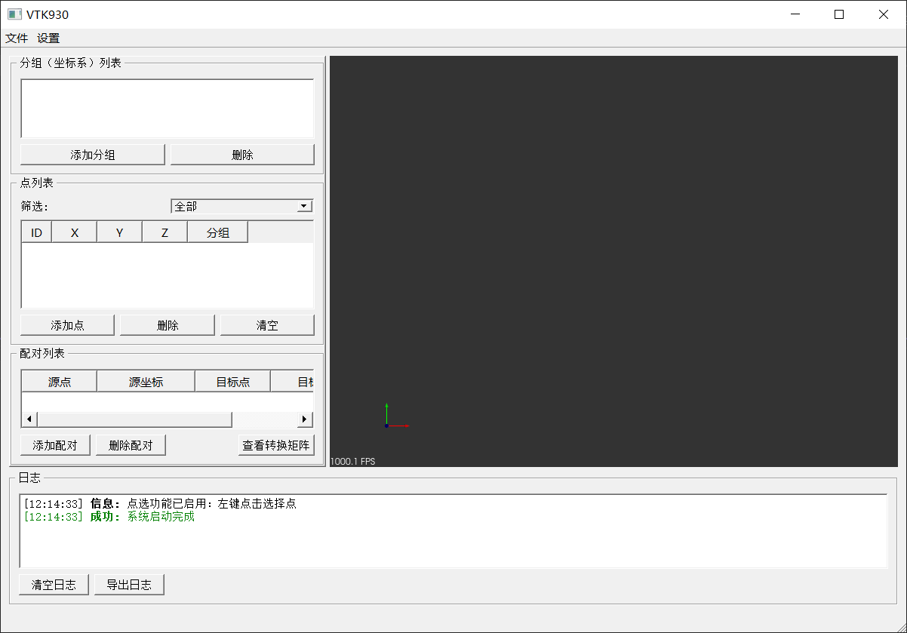
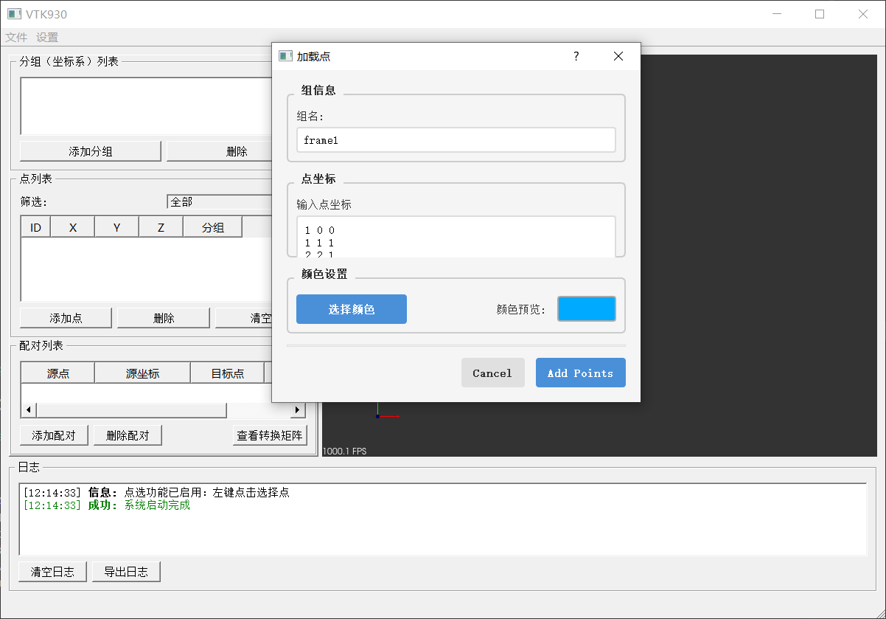
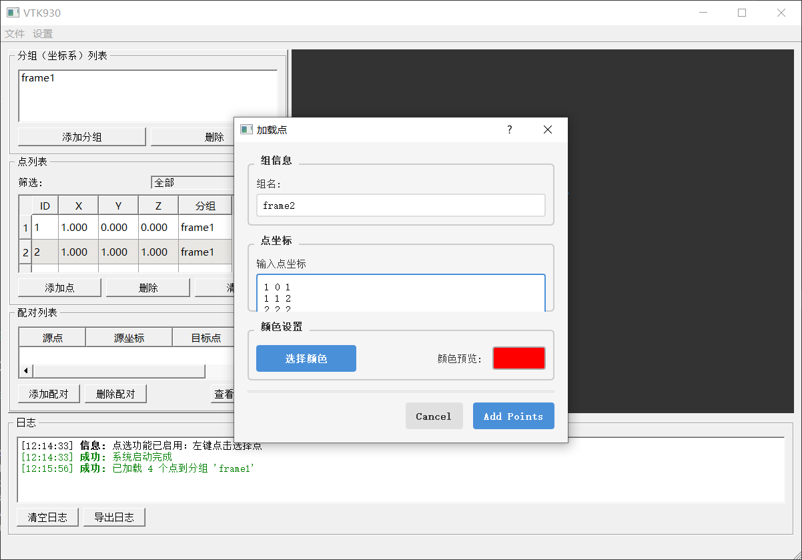
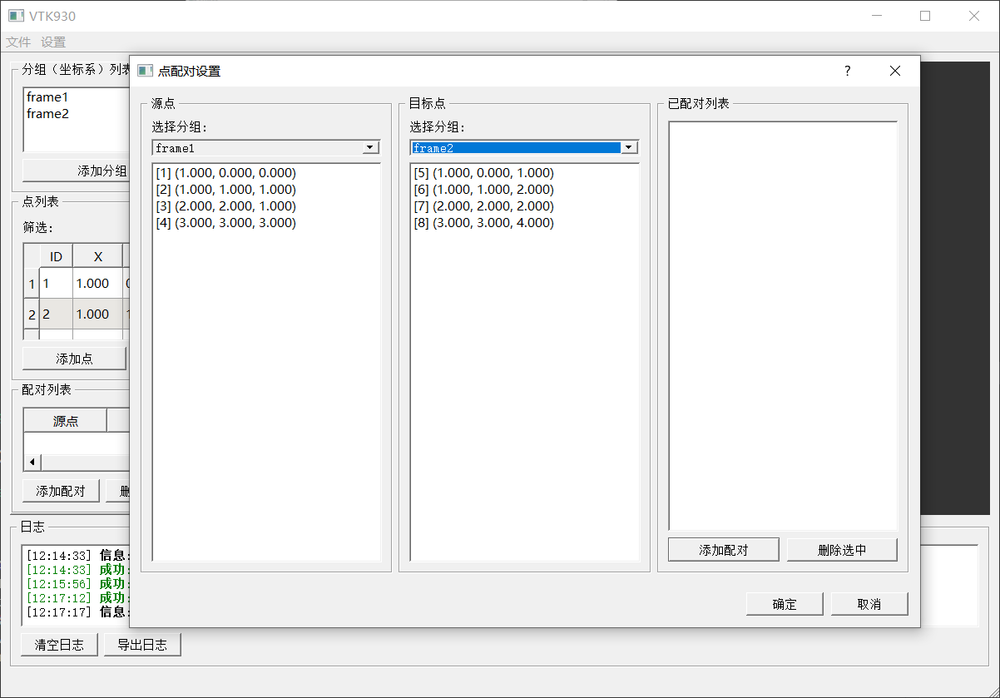
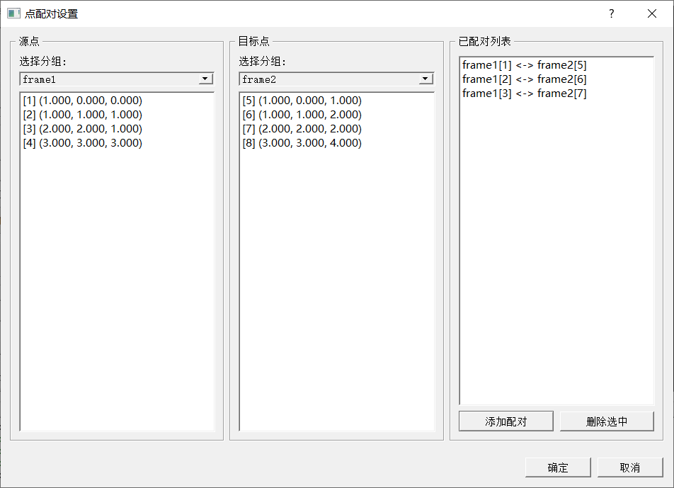
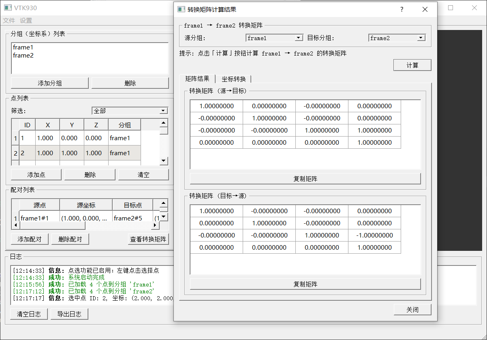
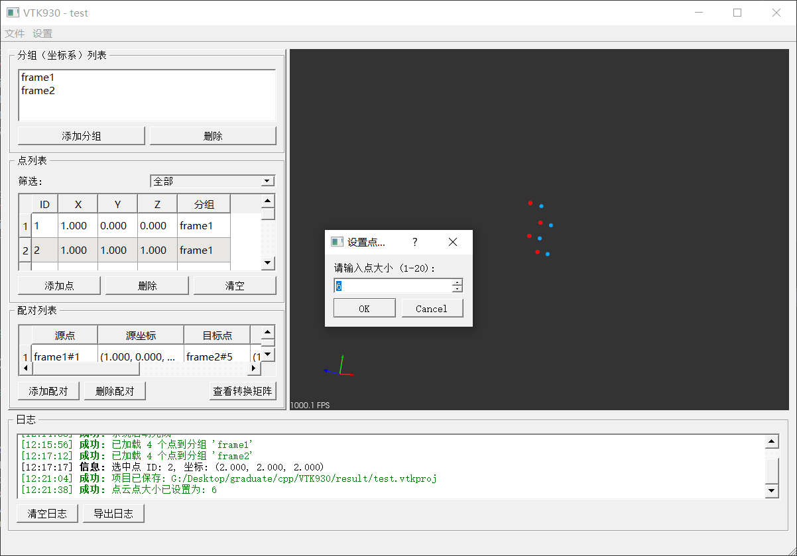
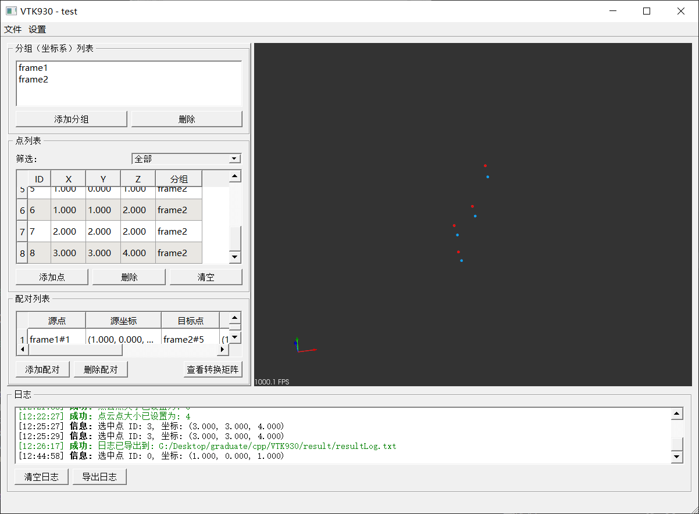
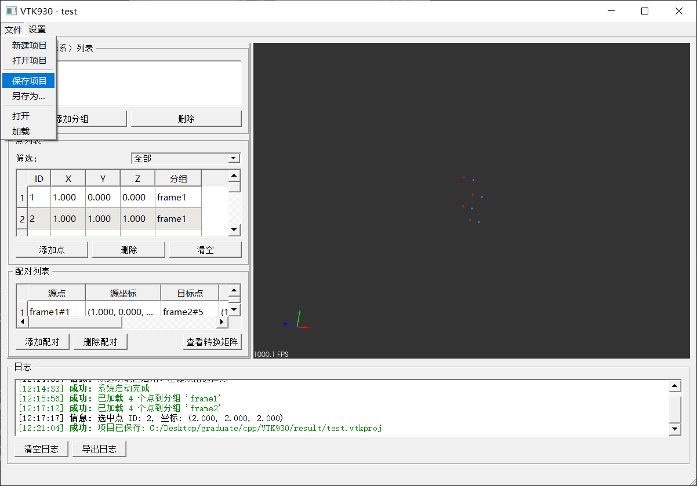

# VTK930 — 点云坐标转换工具

基于 **Qt 5.15.2 + PCL 1.14.0 + VTK 9.3.0 + Eigen 3.4.0** 的桌面级点云坐标转换工具，支持多分组点云管理、点配对及转换矩阵计算、批量坐标转换。

---

## 功能概览

| 功能模块 | 说明 |
|---------|------|
| 点云加载 | 支持 PCD 文件加载及手动输入点坐标 |
| 多分组管理 | 创建/删除分组，为每组点云分配独立颜色 |
| 3D 可视化 | 基于 VTK 的交互式 3D 视图，支持旋转/缩放/平移 |
| 点配对 | 建立不同分组间的对应点对 |
| 转换矩阵计算 | 基于 Umeyama/SVD 算法计算最优刚性变换矩阵 |
| 批量坐标转换 | 将一组点云按计算出的矩阵转换到目标坐标系 |
| 项目持久化 | 通过 JSON 保存/加载项目数据 |

---

## 界面预览

### 主界面

左侧为控制面板（分组列表、点列表、配对列表），右侧为 VTK 3D 可视化区域，底部为日志窗口。



### 添加点

支持手动输入点坐标，指定所属分组，并自定义显示颜色。

| 点输入对话框 | 添加效果 |
|:---:|:---:|
|  |  |

### 点配对

在不同分组之间建立对应点对，用于后续转换矩阵计算。

| 配对对话框 | 配对列表 |
|:---:|:---:|
|  |  |

### 转换矩阵结果

基于点配对自动计算 A→B 和 B→A 的 4x4 齐次变换矩阵，支持一键复制。



### 点大小与点选

| 点大小设置 | 3D 点选 |
|:---:|:---:|
|  |  |

### 项目保存

通过 JSON 格式保存完整的项目数据。



---

## 项目结构

```
VTK930/
├── VTK930.h / .cpp          # 主窗口（核心逻辑）
├── VTK930.ui                # UI 布局
├── main.cpp                 # 程序入口
├── PointCloudInputDialog    # 点云输入对话框
├── PointPairDialog          # 点配对对话框
├── TransformResultDialog    # 转换结果对话框
├── GroupNameDialog          # 分组名称输入对话框
├── imgs/                    # 截图资源
├── data/                    # 示例 PCD 数据
└── result/                  # 导出结果
```

---

## 核心数据结构

```cpp
// 点数据
struct PointData {
    std::string id;               // 点ID
    float x, y, z;                // 坐标
    std::string groupName;        // 所属分组
    int colorR, colorG, colorB;   // 显示颜色
};

// 点配对
struct PointPair {
    std::string sourceGroup;      // 源分组
    std::string targetGroup;      // 目标分组
    std::string sourceId;         // 源点ID
    std::string targetId;         // 目标点ID
    Point3D sourcePoint;          // 源点坐标
    Point3D targetPoint;          // 目标点坐标
};

// 转换矩阵
struct TransformationMatrix {
    Eigen::Matrix3d rotation;     // 3x3 旋转矩阵
    Eigen::Vector3d translation;  // 3x1 平移向量

    Eigen::Matrix4d toMatrix() const;  // 转 4x4 齐次矩阵
};
```

---

## 核心算法：Umeyama（SVD）刚体变换

通过对应点对求解最优旋转矩阵 R 和平移向量 t：

```
P_target = R x P_source + t
```

计算步骤：

1. 计算两组点的质心
2. 去中心化处理
3. 构建协方差矩阵
4. SVD 分解求解旋转矩阵
5. 计算平移向量

```cpp
// Eigen 实现核心逻辑
Eigen::MatrixXd src(3, n), tgt(3, n);
// 填充对应点坐标 ...
Eigen::Vector3d srcCenter = src.rowwise().mean();
Eigen::Vector3d tgtCenter = tgt.rowwise().mean();
src.colwise() -= srcCenter;
tgt.colwise() -= tgtCenter;

Eigen::Matrix3d cov = src * tgt.transpose();
Eigen::JacobiSVD<Eigen::Matrix3d> svd(cov, Eigen::ComputeFullU | Eigen::ComputeFullV);
Eigen::Matrix3d R = svd.matrixV() * svd.matrixU().transpose();
Eigen::Vector3d t = tgtCenter - R * srcCenter;
```

---

## 依赖库

| 库 | 版本 | 用途 |
|---|------|------|
| Qt | 5.15.2 | GUI 框架 |
| PCL | 1.14.0 | 点云处理与 I/O |
| VTK | 9.3.0 | 3D 可视化 |
| Eigen | 3.4.0 | 矩阵运算（SVD） |

---

## 快速开始

1. 使用 Visual Studio 2019+ 打开 `VTK930.sln`
2. 确保已安装上述依赖库，正确配置包含/库目录
3. 编译运行
4. **文件 → 打开** 加载 PCD 文件，或**文件 → 加载** 手动输入点
5. 创建分组 -> 添加点 -> 建立配对关系
6. 点击**查看转换矩阵**计算结果
7. 使用**批量转换**将点云转换到目标坐标系